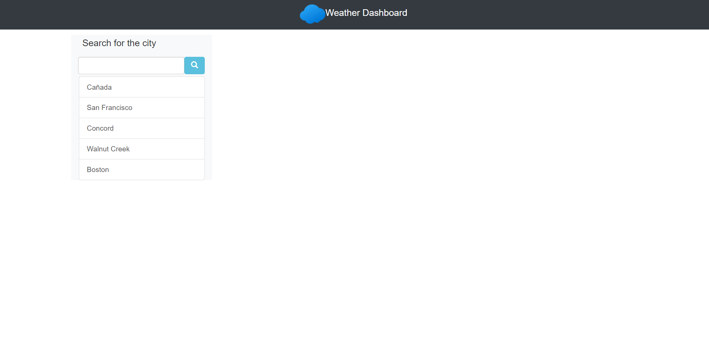
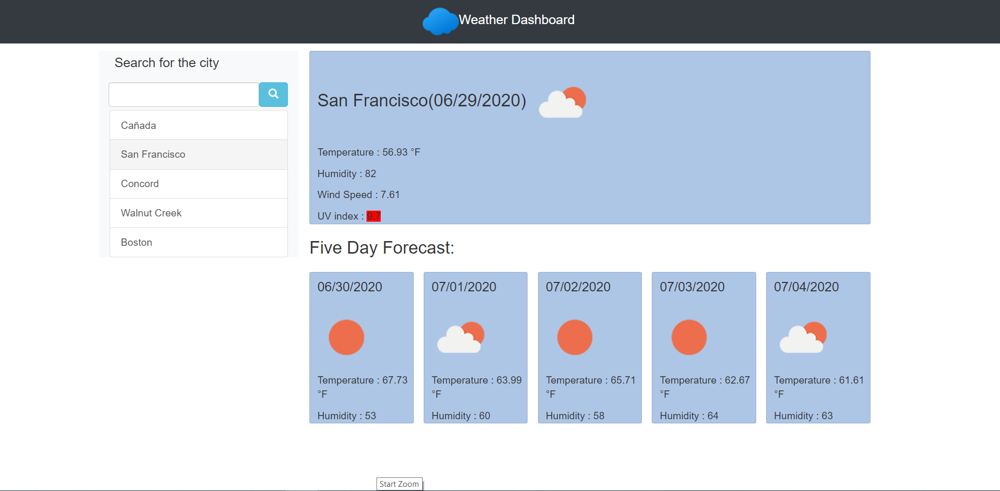

# weather-dashboard

The purpose of this project was to create a weather dashboard which will display the current weather condition of the city entered by the user as well as 5-day forecast of the given city.The search will be stored in our local storage area, and display as in list format from where we can select the city, and their present as well as their future five day forecast of that city.
 

## Getting Started

### Prerequisites
1. Bootstrap Framework.(https://stackpath.bootstrapcdn.com/bootstrap/4.5.0/css/bootstrap.min.css)

2. *HTML*

3. *CSS*

4. *VS. Code*

5. *Moment.js*

6. *Open Weather API*

7. *AJAX*

8. *JavaQuery*

##  Details of Project

1. At first my website is presented with the input box with list of city last searched, with no display for weather condition for the city and no 5-day forecast but when we enter the city then we can see the weather condition as well as 5-day forecast.
 
2. When we enter the wrong city name it gives an alert message ("not found) which is called from api.

3. when we click on the find button on the side of the input box we get a display of a current condition as well as the five day forecast.

4. We can also select from the list displayed, which came from the last search.

5. My dashboard gives the display of information such as city name, current date, icon representation of current weather condition, temperature, humidity, wind speed and UV index with the color code of the current condition.

6. My dashboard also give the 5-day forecast of the city with information like date of day (1-5), icon for the predicted condition, temperature, and humidity. 

My Weather Dashboard Website Link ->  ()
Default Page

After Select/Searching City

